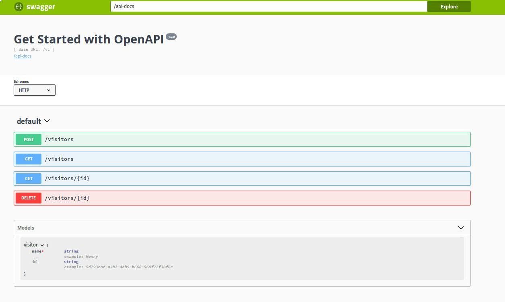
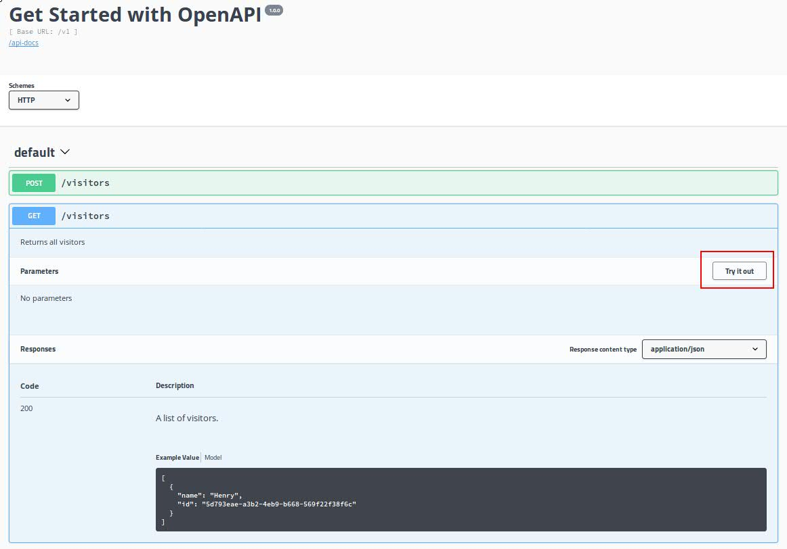
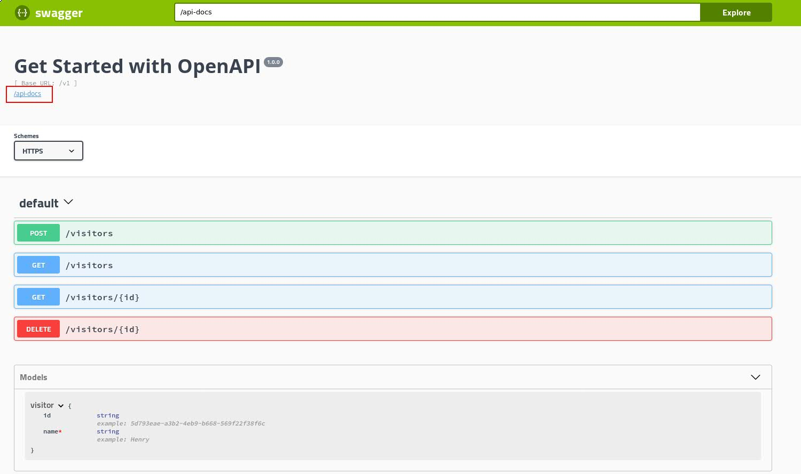
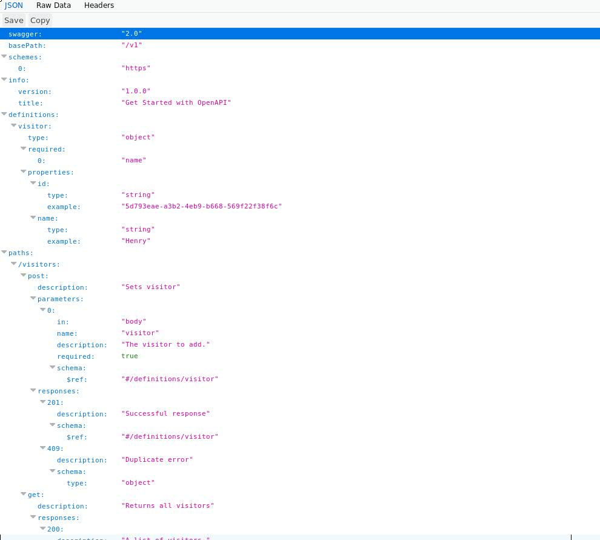

# Challenge 2: Render API documentation from the Application

From the previous challenge, you can use and display the OpenAPI specification you generated as a standalone reference, inaddition to using tools (e.g. Swagger Editor) to display the specification and render API documentation. This is useful but wouldn't it be better to have the docs delivered as part of your app where you would always have the correct version? For this challenge, you will use tools that enable you to easily render API documentation from within your application itself - so that developers using your application can have immediate access to the specification via the URL of your application. To do this, you will use [swagger-tools](https://www.npmjs.com/package/swagger-tools) and [swagger-ui](https://www.npmjs.com/package/swagger-ui) to serve up API documentation using the OAS generated in the previous challenge.

## Steps

1. Install `swagger-tools` and `swagger-ui`

```
npm install --save swagger-tools
npm install --save swagger-ui
```

2. Add the hooks to the application to serve the API documentation

Add the following requirements to the top of your [application main server file](https://github.ibm.com/developer-first-guild/get-started-openapi/blob/master/server.js):

```
const swaggerTools = require('swagger-tools');
const openapiDoc = require('<path_to_the_generated_openapi_spec>');
```
For example `openapiDoc`:
```
const openapiDoc = require('./openapi/openapi');
```

Add the following to your [application main server file](https://github.ibm.com/developer-first-guild/get-started-openapi/blob/master/server.js) to initialize the Swagger UI:

```
swaggerTools.initializeMiddleware(openapiDoc, function (middleware) {
  // Serve the Swagger documents and Swagger UI
  app.use(middleware.swaggerUi());
});
```

3. Restart the application

```
npm start
```

*Note: If the appliaction is already running, stop it first before starting it.*

4. Verify the documentation and the OpenAPI endpoints specification

Go to the following URL: http://localhost:3000/docs

The API documentation should render as follows:



You can test the endpoints and therefore prove the specification is valid by using the `Try it out` capability for the APIs:



5. View the OpenAPI Specification

You can view the specification from the API documentation by clicking on the `api-docs` link as shown:



Hence, by rendering the API documentation via the `swagger-ui` module, not only can users get current, quality presented docs; they can also get access to the raw (`Raw` and `JSON` format) OpenAPI Specification for use by the whole Swagger tools ecosystem. A good return from the app dev perspective also, considering it just requires defining an OpenAPI specification and supporting `swagger-ui`.



## Completion

API documentation is rendered and you verified the OpenAPI endpoints using the `Try it out` capability in the documentation.

## Follow-on

Use OAS to generate Python client library and access the application using this library.

