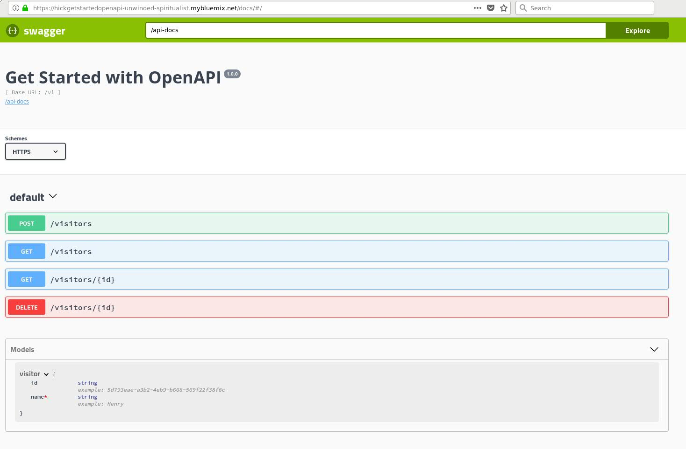

# Challenge 4: Handle APIs from the cloud

Up until now you have being using your app locally. Let's now try and run it remotely from the cloud - in this challenge, you will upload your  app to the [IBM Cloud](https://www.ibm.com/cloud/). This provides you and others with the capability to be able to access your app remotely.

## Prerequisites

The following prerequisites are required for this challenge and future challenges of the OpenAPI Experience:

* An [IBM Cloud](https://console.bluemix.net/registration/) account.
* Installed and configured [IBM Cloud CLI](https://console.bluemix.net/docs/cli/reference/bluemix_cli/get_started.html#getting-started), if not installed, follow the "get started" steps. For federated users, log in to IBM Cloud by following these [steps](https://console.bluemix.net/docs/iam/login_fedid.html#federated_id).

## Steps

1. Update OAS to HTTPS

Like most clouds, the IBM Cloud wants you to use secure connections (i.e. `HTTPS`) to access it's services. You will therefore need to update the OAS so that your API docs "Try it out" capability still works. Change the following lines in `./openapi/openapi.json` (if default path for OAS used) or `<path_to_the_generated_openapi_spec>`:

```
"schemes": [
    "http"
  ],
```
to:

```
"schemes": [
    "https"
  ],
```

2. Push the app to the IBM Cloud

```
Tip: You will be using IBM Cloud CLI to interact with IBM Cloud from your system.

To confirm if the CLI is installed, run:

bx --version

This command should return output similar to the following:

bx version 0.6.6+d4d59ab-2018-03-20T07:38:15+00:00

To confirm if configured and connected to the cloud, run:

bx target

This command should return output similar to the following:

API endpoint:     https://api.ng.bluemix.net (API version: 2.92.0)
Region:           us-south
User:             jane.doe@example.com
Account:          ACME
Resource group:   default
Org:              ACME
Space:            dev

Note: "Org" and "Space" should be set to confirm connection to the cloud. If not, you can set it with the command `bx target -o <organization> -s <space>`.

If any of the commands don't run as expected, then refer back to the "Prerequisites" section at the start of the challenge, for setup.
```

You can deploy or push your app to IBM Cloud as follows:

```
bx app push
```

A manifest is a file that tells IBM Cloud how to deploy the application. Each line in the manifest provides instructions to IBM Cloud about the deployment. These instruction are then referenced when the `push` command is called. The manifest file for you application is at `./manifest.yml` and more information can be garnered about manifests at "[Deploying with Application Manifests](https://docs.cloudfoundry.org/devguide/deploy-apps/manifest.html)".

Deploying your application can take a few minutes. When deployment completes, you'll see a message that your app is running. View your app at the URL listed in the output of the push command, or view both the app deployment status and the URL by running the following command:

```
bx app list
```

Output should be similar to the following with the list of apps deployed for the org and space:

```
bx app list
Invoking 'cf apps'...

Getting apps in org Acme / space dev as jane.doe@example.com...
OK

name                                                         requested state   instances   memory   disk   urls
Tst1GetStartedOpenAPI                                        started           1/1         256M     1G     tst1getstartedopenapi-foveolate-joint.mybluemix.net
Tst2GetStartedOpenAPI                                        started           1/1         256M     1G     tst2getstartedopenapi-unwinded-spiritualist.mybluemix.net
```

```
Tip: You can troubleshoot errors in the deployment process by using the bx app logs <Your-App-Name> --recent command.
```

3. Verify the documentation and the OpenAPI endpoints specification

Go to URL: https://<app_url_on_cloud>/docs

The API documentation should render similar to the following:



Run the "Try it out" capability for each API and confirm that it works as expected.

4. Verify that you can connect to the API endpoints using the client library

The client library was generated with the OAS locally. The base URL is set to your local server and needs to be updated to the cloud URL. You will therefore need to update the following line of code in `<path_to_extracted_code>/python-client/swagger_client/configuration.py`

```
self.host = "http://localhost:3000/v1"
```
to:

```
self.host = "https://<app_url_on_cloud>/v1"
```

With the application still running on the cloud, you can run the [test code](https://github.ibm.com/developer-first-guild/get-started-openapi/blob/master/test/test_apis.py) and client as follows:

```
python ./test/test_apis.py
```

The output to the tests should be similar to the following:

```
.
----------------------------------------------------------------------
Ran 3 tests in 0.043s

OK
```

## Completion

Your app works on the cloud as it did locally.
